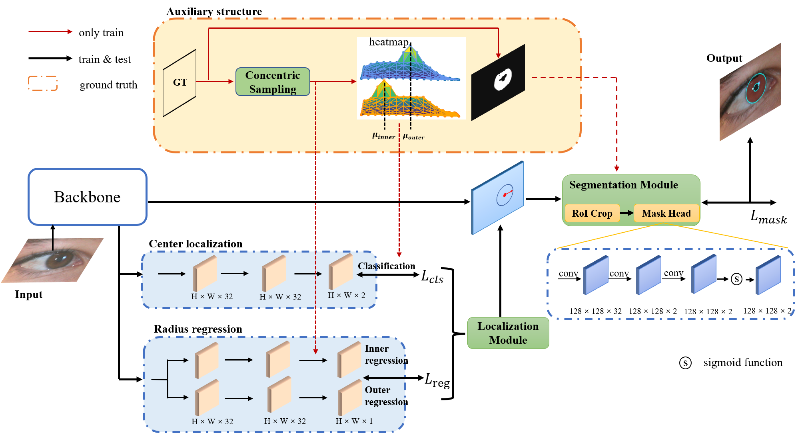
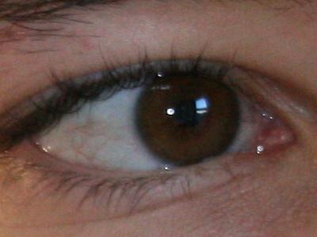
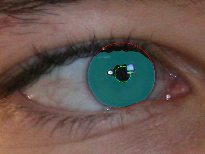

# Double-Center-Based Iris Localization and Segmentation in Cooperative Environment with Visible Illumination

This project hosts the code for implementing the ICSNet algorithm for iris localization and segmantation.


## Abstract

We propose a simple yet efficient anchor-free Iris Center localization and Segmentation Network, named ICSNet. Unlike using post-process on iris mask or contour mask to fit the inner and outer circle, we consider the physiological characteristics of the iris region and first use center points to estimate the circle boundary of pupil and iris. ICSNet:1) Firstly, we locate the center of the outer pupil circle and the outer iris circle and then regress the radius directly based on the center. 2) Based on the first step, we crop the corresponding Circular region from the feature map as the input of the segmentation branch. After the segmentation branch processing, we get the mask of iris segmentation. In experiment part, we evaluate our model on two public iris datasets: NICE-II and MICHE. Extensive experiments show that our model achieved excellent performance on iris localization and segmentation. Especially, our model achieves 84.02% box IoU and 89.15% mask IoU on NICE-II, outperforming the existing state-of-the-art methods by nearly 3.8% and 1.65% respectively. On MICHE, our model achieve 73.76% box IoU, surpassing previous methods by nearest 9.68%.





## Dataset

| Dataset   | Train set                                 | Test set                                 | Total images | Download Link                      |
| --------- | ----------------------------------------- | ---------------------------------------- | ------------ | ---------------------------------- |
| NICEI-II  | training set (1,000 images, 171 subjects) | testing set (1,000 images, 150 subjects) | 2,000        | http://iris.di.ubi.pt/ubiris2.html |
| MICHE-GS4 | all indoor images (total 663 images)      | all outdoor images (total 634 images)    | 1,297        | http://biplab.unisa.it/MICHE/      |
| MICHE-IP5 | all indoor images (total 631 images)      | all outdoor images (total 631 images )   | 1,262        | http://biplab.unisa.it/MICHE/      |
| MICHE-GT2 | all indoor images (total 316 images)      | all outdoor images (total 316 images )   | 632          | http://biplab.unisa.it/MICHE/      |

We do not have permission to release the original iris images for MICHE and UBIRIS.v2 databases, hence if you want to use the ground truths of these two databases, you can email the owners of both databases to request permission and let us know if given permission. We will provided the password of ground truth files.


## Main results

Box mIoU and  Norm Hausdorff distance of inner/outer circle. E1, E2, F1-score and mask mIoU of iris mask.

| Dataset | $\mathrm{mIoU_{inner}^{box}}$ | $\mathrm{mIoU_{outer}^{box}}$ |  $\mathrm{mHdist_{inner}}$ | $\mathrm{mHdist_{outer}}$ | $\mathrm{mHdist_{avg}}$ | $\mathrm{E1^{mask}}$ | $\mathrm{E2^{mask}}$ | $\mathrm{F1^{mask}}$ |  $\mathrm{mIoU^{mask}}$ | $\mathrm{E1^{norm}}$ |
| ------- | ----------------------------- | ----------------------------- | ---- | ------------------------- | ------------------------- | ----------------------- | -------------------- | -------------------- | -------------------- | ---------------------- |
| MICHE-GS | 0.645266 | 0.863545 | 0.015446 | 0.016939 | 0.01720 | 0.00505 | 0.00252 | 0.80829 | 0.70830 | 0.25198 |
| MICHE-IP | 0.638943 | 0.878774 | 0.024999 | 0.014794 | 0.01990 | 0.00356 | .00178 | 0.84320 | 0.74906 | 0.20702 |
| MICHE-GT2 | 0.574708 | 0.860641 | 0.038183 | 0.038183 | 0.03048 | 0.00606 | 0.00303 | 0.79912 | 0.68572 | 0.23199 |
| NICE-II | 0.740537 | 0.945687 | 0.014396 | 0.010122 | 0.01226 | 0.00791 | 0.00396 | 0.94233 | 0.89221 | 0.09252 |


## Quick demo

First, download the trained weights and put them in `/checkpoints/NICEII/`. 

+ MICEH-GS
+ MICHE-IP
+ MICHE-GT2
+ NICE-II

run:

```
python detect.py
```

We provide example images of NICE-II in `/test_images/`, if environment is correctly, the output should look like

<center>
    
    
</center>


## Evaluation and Training

When evaluate or train model, run `eval_model_all.py` or `train.py`.


## Citation

If you find this project useful for your research, please use the following BibTeX entry.

```
@article{icsnet,
  title={Double-Center-Based Iris Localization and Segmentation in Cooperative Environment with Visible Illumination},
  author={Li, Jiangang and Feng, Xin},
  journal={Sensors},
  volume={23},
  number={4},
  pages={2238},
  year={2023},
  publisher={MDPI}
}
```


