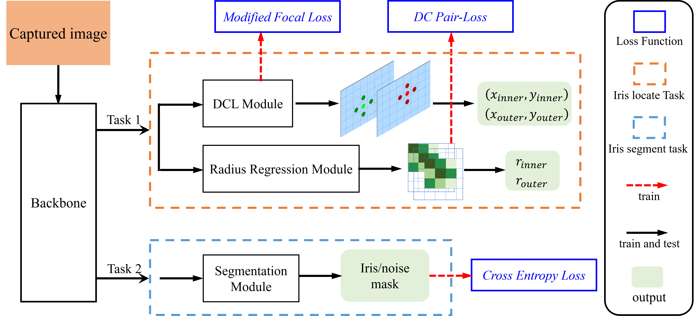

## Dual-Task Network for End-to-End Iris Segmentation and Localization

### News:
In this work, we present a new framework for end-to-end iris localization and segmentation. 

The paper link will be updated in the near future.

### Methods

### Demo

https://github.com/chgex/PSNet/assets/56501904/780587c4-1dee-426e-9943-d1bb5609ae3b

---------------------
https://github.com/chgex/PSNet/blob/main/demo/__md__/t2.avi

more details, please click [here](./demo/).

### Previous work

please read [icsnet](./ICSNet/).

